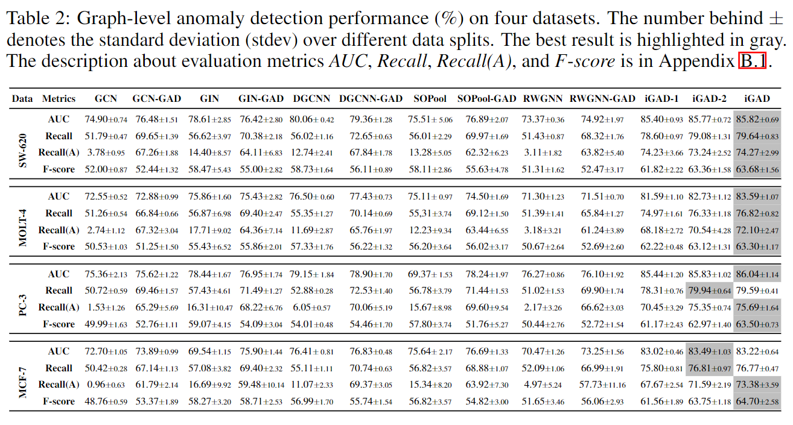
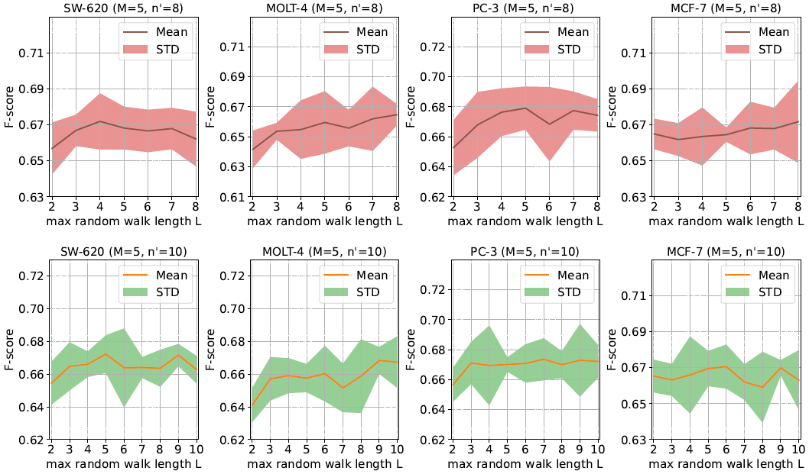

# NeurIPS_Rebuttal

# 1. The Updated Figure 1

**a. We reorganize Figure 1. The step III appears behind steps I and II now.**

**b. In step II, we add the node id to highlight which paths the light blue nodes refer to from the input graph $G_N$.**

**c. We rewrite to caption of Figure 1 to make it easy to follow.**

# 2. The Updated Table 2

**The best result achieved by iGAD-2 on MCF-7 is highlighted.**

# 3. The Updated Figure 3 (Experiments under random walk length > 8 nodes )

**a. We add M (the number of learnable substructures) and n' (the size of learnable substructures) to the caption of Figure 3.**

**b. We add the experiment result under the bigger size of random walk (> 8 nodes)**

